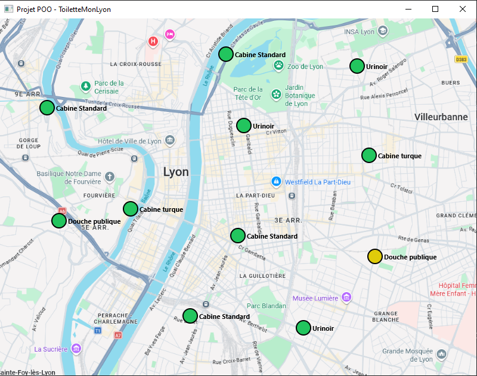
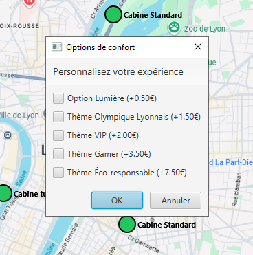
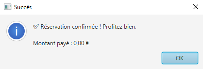
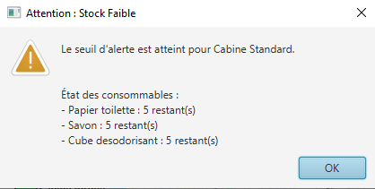
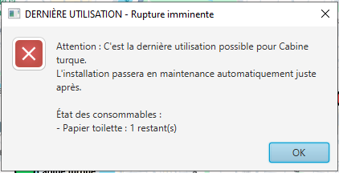
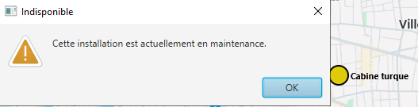

# Fiche rendu projet

> Ce document est un bilan destiné au client. Présentez ce qui a été livré, ce qui fonctionne, et tournez habilement ce qui manque. Pas de jargon technique — on parle de fonctionnalités et de valeur perçue.

## Rappel du projet

ToiletteMonLyon est une plateforme lyonnaise permettant de réserver en ligne des installations sanitaires publiques et privées à Lyon : cabines de toilettes, urinoirs et douches. Le projet vise à proposer un service simple et fiable pour les usagers lyonnais.

## Ce qui a été livré

#### *Réservation d'une installation à Lyon*

Le parcours de réservation fonctionne : sélection d’une installation, validation du choix et confirmation de la réservation.

#### *Choix d’un thème et d’une ambiance*

L’utilisateur peut personnaliser son expérience via des options de décoration et d’ambiance.

#### *Paiement adapté*

La logique distingue les besoins spécifiques : les personnes en situation de handicap bénéficient d’un accès gratuit à l’installation, tandis que les options restent payantes.

#### *Gestion proactive du stock*

Le système surveille l’état des consommables et déclenche une alerte lorsque l’installation approche de la fin de son service.

#### *Mise en maintenance automatique*

Une installation qui n’est plus utilisable passe automatiquement en maintenance pour éviter les mauvaises surprises.

#### *Protection contre les doubles réservations*

Le système bloque une installation pendant le temps de réservation, ce qui garantit qu’un autre utilisateur ne peut pas réserver en même temps.

## Ce qui n'a pas été livré (et pourquoi)

- La création de compte client n’a pas été intégrée dans cette première version, car nous avons choisi de prioriser le cœur du service : une réservation rapide et fiable. C’est une bonne approche pour un MVP.

- Le signalement de propreté et l’interface d’administration ne sont pas encore développés, car ces fonctionnalités nécessitent une couche de gestion dédiée qui dépasse le périmètre du lancement initial.

- Les avis anonymes restent à venir : ils demandent une gestion plus complète des profils et des historiques, ce qui est prévu pour une évolution suivante.

- Le pass journée n’a pas été proposé dans cette phase, parce que ce modèle demande une réflexion complémentaire sur l’équilibre financier et l’usage. Nous avons préféré stabiliser la réservation standard avant de lancer des offres premium.

## Perspectives

- Ajouter des comptes clients pour garder une trace des préférences, des réservations et des avis.

- Développer un espace administrateur pour piloter les installations et gérer les interventions.

- Proposer des offres avancées comme un pass temps limité une fois le socle de réservation confirmé.

- Renforcer l’expérience utilisateur avec des notifications et un suivi après utilisation.

> Résultat : la version livrée propose déjà un service concret et utile. Les évolutions manquantes représentent des améliorations naturelles, basées sur une base fonctionnelle déjà solide.
