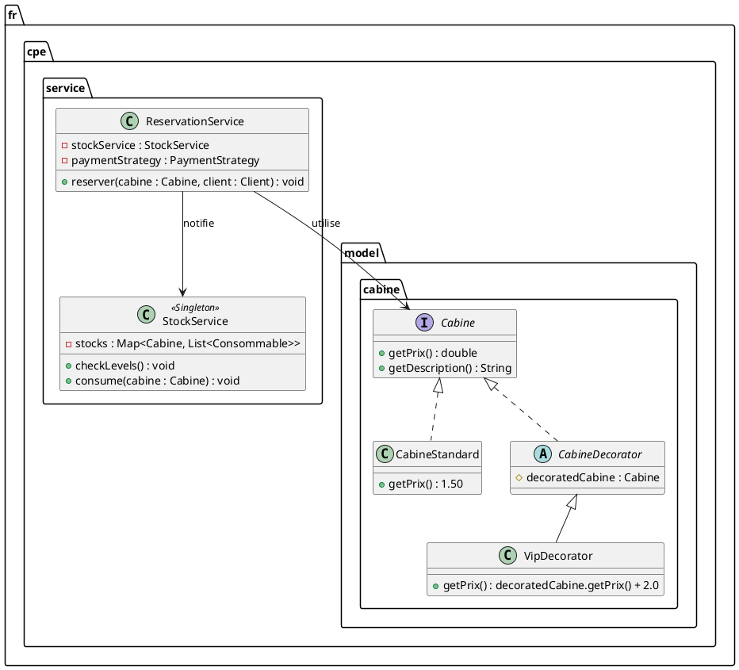
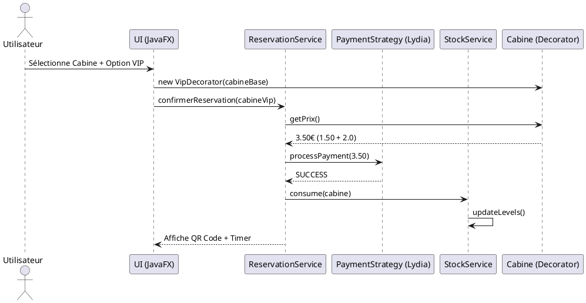

# Conception Technique : ToiletteMonLyon

> **Contexte :** Application JavaFX locale avec Injection de Dépendances (Guice).

## Vue d'ensemble

L'architecture repose sur un découpage en trois couches principales pour garantir la séparation des préoccupations (*Separation of Concerns*) :

1.  **Engine** (`fr.cpe.engine`) : Le cœur réactif. Gère la boucle de rafraîchissement (`GameEngine`) pour les éléments temps réel (timers de cabine, animations de la carte) et la capture des entrées utilisateur (`InputService`).
2.  **Service** (`fr.cpe.service`) : La couche métier. Orchestre les réservations, calcule les tarifs dynamiques, gère les stocks de consommables et interagit avec la géolocalisation des cabines.
3.  **Model** (`fr.cpe.model`) : Les données métier (POJO). Représente les `Cabine`, les `Utilisateur`, les `Reservation` et les `Consommable`.

L'injection de dépendances via **Guice** permet de coupler ces composants de manière lâche. Par exemple, `ReservationService` reçoit automatiquement une instance de `StockService` et de `PaymentStrategy` sans instanciation manuelle.


[Image of MVC Architecture diagram]


---
toilette turque
urinoire
douche


toilette douche consommable interfac a des consomable

toilette urinoire esque il y a un lavabo interface

fin de la prestation on notifie le sobserveirs de divers évènements exemple plus de papier le stock alert nettoyage occupé

## Design Patterns (DP)

### DP 1 — Singleton

**Feature associée :** Gestion des stocks et inventaire (`StockService`).

**Justification :** L'état des stocks (papier, savon, gel) pour l'ensemble des cabines de Lyon doit être unique et cohérent. Si plusieurs instances du service de stock existaient, une alerte de maintenance pourrait être ignorée ou traitée en double. Le Singleton garantit que l'interface d'administration et le système de réservation consultent la même base de données en temps réel.

**Intégration :** `StockService` est annoté `@Singleton`. Il est injecté dans le `ReservationService` (pour décrémenter après usage) et dans le `AdminController` (pour l'affichage des alertes).

### DP 2 — Decorator

**Feature associée :** Personnalisation et thèmes de cabines (OL, VIP, Gamer).

**Justification :** Les options de personnalisation du pitch sont cumulables (ex: une cabine peut être à la fois "VIP" et "Fête des Lumières"). L'héritage classique mènerait à une explosion combinatoire de classes. Le Decorator permet d'ajouter dynamiquement des fonctionnalités (lumières LED, musique, prix supplémentaire) à une instance de cabine de base.

**Intégration :** * Interface : `Cabine`
* Composant concret : `CabineStandard`
* Décorateurs : `VipDecorator`, `OlDecorator`, `LumiereDecorator`.
* Chaque décorateur surcharge `getPrix()` et `getEquipements()`.
On peut applique 1 ou plusieurs options à la réservation


### DP 3 — Strategy

**Feature associée :** Système de paiement flexible (Lydia, CB, Pass Journée).

**Justification :** L'application doit supporter plusieurs méthodes de paiement sans que la logique de réservation ne dépende de l'implémentation technique (API Lydia vs Stripe vs Système de jetons). Le pattern Strategy permet de basculer entre les algorithmes de paiement à la volée.

**Intégration :** Une interface `PaymentStrategy` avec une méthode `processPayment(double amount)`. Les implémentations `LydiaStrategy` et `CardStrategy` sont injectées selon le choix de l'utilisateur dans l'interface JavaFX.

### DP 4 — Factory

**Feature associée :** Création des différents types de cabines sur la carte.

**Justification :** Pour l'initialisation de la carte de Lyon, nous devons générer des types d'objets complexes (Cabine PMR, Cabine Auto-nettoyante, Urinoir). La Factory centralise la création pour s'assurer que chaque type possède ses attributs par défaut (ex: une cabine PMR est toujours gratuite pour les ayants droit).

**Intégration :** `CabineFactory` propose des méthodes comme `createPMR(double lat, double lng)`. Elle est utilisée lors du chargement initial des données géographiques.

---

## Diagrammes UML

### Diagramme de classes (Structure des Services)



### Diagramme de séquence (Processus de Réservation)



---

## Architecture des dossiers

Le projet suit la structure Maven standard demandée :

```text
src/main/java/fr/cpe/
├── App.java                 # Initialisation JavaFX & Guice
├── AppModule.java           # Configuration des injections (Strategy/Decorator)
├── engine/                  # Socle technique
│   ├── GameEngine.java      # Boucle de rafraîchissement des réservations
│   └── InputService.java    # Gestion des clics sur la carte
├── model/                   # Objets de données
│   ├── cabine/              # CabineStandard + Décorateurs
│   └── user/                # Client + Admin
└── service/                 # Logique métier
    ├── ReservationService.java
    ├── StockService.java
    └── PaymentService.java
```
