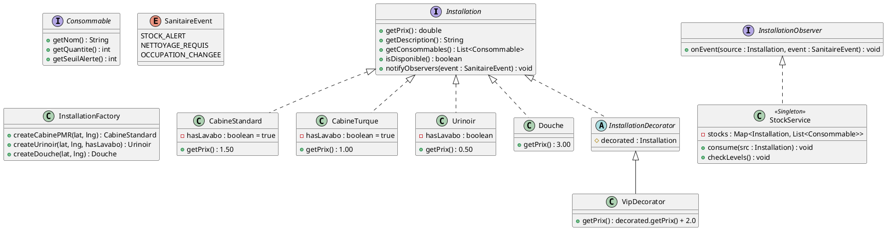
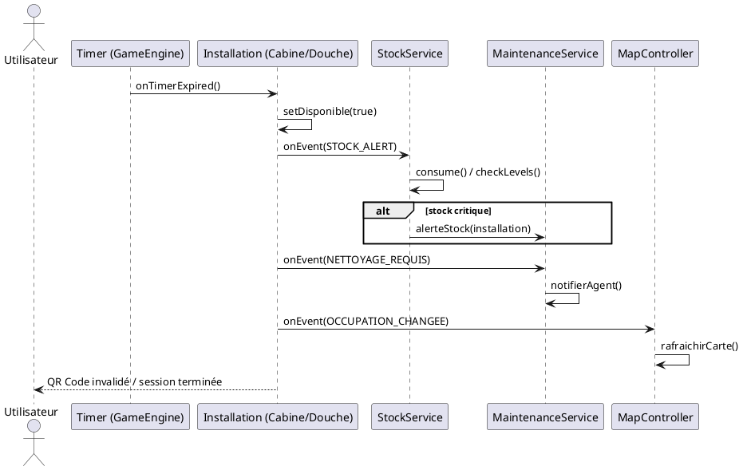

# Conception Technique : ToiletteMonLyon

> Ce document décrit l'architecture technique de votre projet. Vous êtes dans le rôle du lead-dev / architecte. C'est un document technique destiné à des développeurs.
> Contexte : Application JavaFX locale avec Injection de Dépendances (Guice).

## Vue d'ensemble

L'architecture repose sur un découpage en trois couches principales pour garantir la séparation des préoccupations (Separation of Concerns) :

- Engine (fr.cpe.engine) : Le cœur réactif. Gère la boucle de rafraîchissement (GameEngine) pour les éléments temps réel (timers de cabine, animations de la carte) et la capture des entrées utilisateur (InputService).

- Service (fr.cpe.service) : La couche métier. Orchestre les réservations, calcule les tarifs dynamiques, gère les stocks de consommables et interagit avec la géolocalisation des installations.

- Model (fr.cpe.model) : Les données métier (POJO). Représente les installations (Installation, Cabine, Urinoir, Douche), les Utilisateur, les Reservation et les Consommable.

L'injection de dépendances via Guice permet de coupler ces composants de manière lâche.

## Hiérarchie du Modèle — Les Installations

Le terme générique "cabine" est remplacé par une hiérarchie claire d'installations sanitaires, chacune ayant ses propres équipements et consommables.

### Interface Installation

Toutes les installations partagent un contrat commun :

- getPrix() : double

- getDescription() : String

- getConsommables() : List<lesConsommables>

- isDisponible() : boolean

### Interface Consommable

Les consommables sont modélisés via une interface dédiée permettant de gérer n'importe quel type d'article (papier, savon, shampooing, etc.). Chaque installation agrège une liste de Consommable, ce qui permet à StockService de traiter toutes les installations de façon uniforme.

- getNom() : String

- getQuantite() : int

- getSeuilAlerte() : int

### Types d'installations concrètes

Trois types d'installations concrètes implémentent l'interface Installation :

1. Cabine (toilettes)

Deux variantes : toilette standard et toilette turque (CabineTurque). Les deux exposent un lavabo intégré (hasLavabo() : boolean retourne toujours true). Consommables associés : papier toilette, savon, gel hydroalcoolique, désodorisant.

2. Urinoir

Installation sans cabine fermée, sans réservation temporelle stricte (rotation libre). La question du lavabo est paramétrable : certains blocs urinoirs disposent d'un lavabo commun (hasLavabo() configurable à la création via CabineFactory). Consommables associés : cubes désodorisants, spray assainissant.

3. Douche

Installation avec timer obligatoire et consommables spécifiques. Pas de lavabo distinct (la douche intègre le point d'eau). Consommables associés : shampoing, gel douche, serviettes (si service inclus).


## Design Patterns (DP)

### DP 1 — Singleton

**Feature associée :** Gestion des stocks et inventaire (`StockService`).

**Justification :** L'état des stocks (papier, savon, gel, shampooing...) pour l'ensemble des installations de Lyon doit être unique et cohérent. Le Singleton garantit que l'interface d'administration et le système de réservation consultent la même base de données en temps réel.

**Intégration :** `StockService` est annoté `@Singleton`. Il est injecté dans le `ReservationService` (pour décrémenter après usage) et dans le `AdminController` (pour l'affichage des alertes). Il implémente également StockObserver.

### DP 2 — Decorator

**Feature associée :** Personnalisation et thèmes de cabines (OL, VIP, Gamer).

**Justification :** Les options de personnalisation du pitch sont cumulables (ex: une cabine peut être à la fois "VIP" et "Fête des Lumières"). L'héritage classique mènerait à une explosion combinatoire de classes. Le Decorator permet d'ajouter dynamiquement des fonctionnalités (lumières LED, musique, prix supplémentaire) à une instance de cabine de base.

**Intégration :** * Interface : `Cabine`
* Composant concret : `CabineStandard`
* Décorateurs : `VipDecorator`, `OlDecorator`, `LumiereDecorator`.
* Chaque décorateur surcharge `getPrix()` et `getEquipements()`.
On peut applique 1 ou plusieurs options à la réservation


### DP 3 — Strategy

**Feature associée :** Système de paiement flexible (Lydia, CB, Pass Journée).

**Justification :** L'application doit supporter plusieurs méthodes de paiement sans que la logique de réservation ne dépende de l'implémentation technique (API Lydia vs Stripe vs Système de jetons). Le pattern Strategy permet de basculer entre les algorithmes de paiement à la volée.

**Intégration :** Une interface `PaymentStrategy` avec une méthode `processPayment(double amount)`. Les implémentations `LydiaStrategy` et `CardStrategy` sont injectées selon le choix de l'utilisateur dans l'interface JavaFX.

### DP 4 — Factory

**Feature associée :** Création des différents types de cabines sur la carte.

**Justification :** Pour l'initialisation de la carte de Lyon, nous devons générer des types d'objets complexes (Cabine PMR, Cabine Auto-nettoyante, Urinoir). La Factory centralise la création pour s'assurer que chaque type possède ses attributs par défaut (ex: une cabine PMR est toujours gratuite pour les personnes ayants droit).

**Intégration :** InstallationFactory propose des méthodes comme `createCabinePMR(lat, lng)`, `createUrinoir(lat, lng, hasLavabo)`, `createDouche(lat, lng)`. Elle est utilisée lors du chargement initial des données géographiques.

### DP 5 — Observer

**Feature associée :** Notifications de fin de prestation (stock, nettoyage, carte).

**Justification :** Chaque installation est un Observable. À la fin d'une prestation, elle notifie ses observateurs enregistrés des événements STOCK_ALERT, NETTOYAGE_REQUIS et OCCUPATION_CHANGEE. Ce pattern découple totalement la logique métier des cabines des services de maintenance et d'affichage.

---

## Diagrammes UML

### Diagramme de classes (Structure des Services)



### Diagramme de séquence (Processus de Réservation)



---

## Architecture des dossiers

Le projet suit la structure demandée :

```text
src/main/java/fr/cpe/
├── App.java
├── AppModule.java
├── engine/
│   ├── GameEngine.java
│   └── InputService.java
├── model/
│   ├── installation/
│   │   ├── Installation.java          (interface)
│   │   ├── CabineStandard.java
│   │   ├── CabineTurque.java
│   │   ├── Urinoir.java
│   │   ├── Douche.java
│   │   └── decorator/
│   │       ├── InstallationDecorator.java
│   │       ├── VipDecorator.java
│   │       ├── OlDecorator.java
│   │       └── LumiereDecorator.java
│   ├── consommable/
│   │   ├── Consommable.java            (interface)
│   │   ├── PapierToilette.java
│   │   ├── Savon.java
│   │   ├── Shampoing.java
│   │   └── CubeDesodorisant.java
│   ├── observer/
│   │   ├── InstallationObserver.java   (interface)
│   │   └── SanitaireEvent.java         (enum)
│   └── user/
│       ├── Client.java
│       └── Admin.java
└── service/
    ├── ReservationService.java
    ├── StockService.java
    ├── MaintenanceService.java
    ├── PaymentService.java
    └── InstallationFactory.java

```
