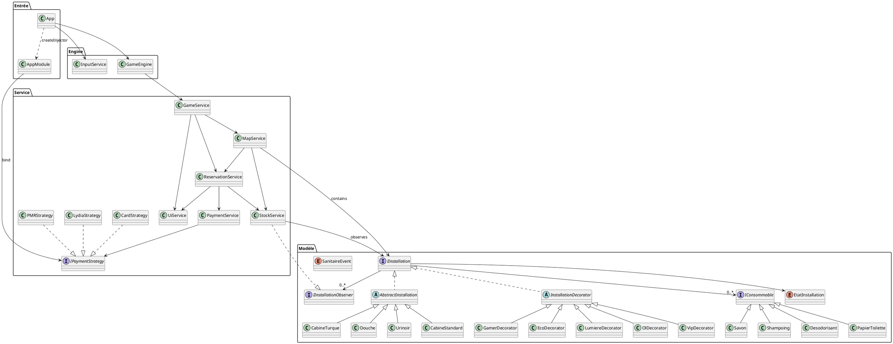

# Document de réversibilité technique

> Ce document est destiné à l'équipe qui reprendra la maintenance du projet. Soyez honnêtes et exhaustifs. Pas d'enjolivement.

## Architecture actuelle

<!-- Diagramme de classes ou de composants reflétant l'état RÉEL du code (pas la conception initiale). -->



## Documentation technique

L'intégralité de la logique métier et des signatures de méthodes est documentée via **Javadoc**. Vous pouvez générer et consulter la documentation locale en suivant ces étapes :

### Génération des rapports
Pour compiler les commentaires Java et générer le site statique HTML, utilisez la commande Gradle suivante :
```bash
./gradlew javadoc
```

### Consultation
Une fois la génération terminée, les fichiers sont disponibles dans le répertoire :
`build/docs/javadoc/index.html`

## Bugs connus

<!-- Listez tous les bugs identifiés, même mineurs. Précisez les conditions de reproduction. -->

| Bug | Sévérité | Conditions de reproduction |
|-----|----------|---------------------------|
| Aucune gestion d'annulation dans les dialogues de paiement | Moyen | Cliquer sur annuler dans la boîte de dialogue de paiement, le comportement n'est pas toujours explicite. |
| Paiement CB toujours accepté | Moyen | Choisir CB dans la réservation, le système retourne toujours succès même si le montant est incorrect. |
| Injection Guice directe dans `ReservationService` | Moyen | Le code utilise `App.injector.getInstance(...)` pour changer de stratégie de paiement, ce qui rend les tests et les extensions difficiles. |

## Limitations techniques

- Pas de persistance des données : l'état des installations, des réservations et du stock est perdu au redémarrage de l'application.

- Le code métier est couplé à l'interface JavaFX : `GameService` et `ReservationService` contiennent des `Alert`, `Dialog` et du rendu graphique.

- Les stratégies de paiement sont simulées : elles ne reflètent pas de véritables intégrations externes.

- Les scénarios de réapprovisionnement et d'usure des consommables sont gérés en mémoire uniquement.

- La configuration des installations est codée en dur dans `MapService`.

## Points de vigilance pour la reprise

- `App.java` et `GameEngine.java` font partie du socle technique : ne modifiez-les fichiers que si vous comprenez bien la boucle JavaFX et le cycle de vie du `AnimationTimer`.

- `AppModule.java` est le point d'entrée des bindings Guice. Toute nouvelle interface doit être reliée ici à une implémentation.

- `ReservationService` mélange la logique métier et l'affichage des dialogues. C'est la zone la plus fragile et la plus importante à tester.

- `StockService` dépend du pattern Observer : chaque installation doit appeler `notifyObservers()` pour que les alertes de stock fonctionnent.

- Les décorateurs (`LumiereDecorator`, `VipDecorator`, `GamerDecorator`, `EcoDecorator`, `OlDecorator`) modifient uniquement le prix et la description ; l'état et les consommables restent ceux de l'installation décorée.

- `MapService` initialise les installations et les enregistre auprès de `StockService`. Si cette étape échoue, les installations ne sont pas suivies pour les alertes de stock.

## Améliorations recommandées

| Amélioration | Difficulté | Justification |
|--------------|------------|---------------|
| Ajouter une gestion explicite des erreurs et des annulations | Moyen | Permet de mieux informer l'utilisateur et d'éviter des flux silencieux. |
| Séparer la logique métier de l'UI | Complexe | Améliore la testabilité et facilite les changements de présentation. |
| Ajouter une persistance des données | Complexe | Rend l'application réutilisable entre plusieurs sessions et évite la perte d'état. |
| Ajouter des tests unitaires pour `ReservationService` et `StockService` | Moyen | Couvre les cas de réservation, de paiement et de rupture de stock. |
| Remplacer l'utilisation directe de `App.injector` par une injection de dépendances propre | Moyen | Diminue le couplage et améliore la maintenabilité. |

